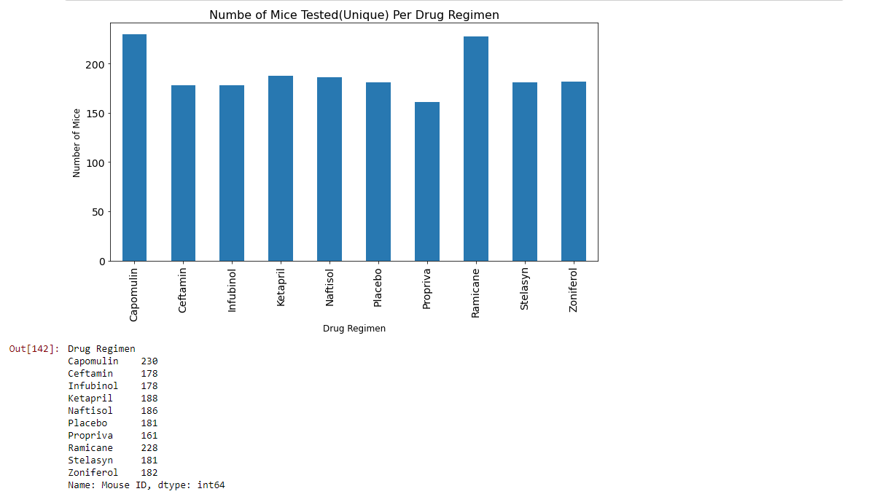

# The-Power-Of-Plots

**Matplotlib Homework - The Power of Plots**

You've joined Pymaceuticals, a company that specializes in anti-cancer pharmaceuticals. 249 mice were expieremented on with drugs to see the measurements of there SCC tumor growth. The expirement
lasted over the course of 45 days where the tumor is measured and observed. Specifically this expirement tests the drug Capomulin against the others and see's the statistical analysis of it. 
This project generates all the tables and figures/plots needed for the technical report. 

The files are stored in my_submissions. The link to the python code is: [pymaceuticals_starter.ipynb](https://github.com/slobanwala1/The-Power-Of-Plots/blob/main/my_submission/Pymaceuticals/pymaceuticals_starter.ipynb). The images are located in [my_submission/Images](https://github.com/slobanwala1/The-Power-Of-Plots/tree/main/my_submission/Images).

## Here are the snapshots by statistics analyzed:

**Observations and Insights**

 
 

**Summary Statistics**

 
 

 

 

 

**Bar and Pie Charts**

 
 

 

 

 

**Quartiles, Outliers and Boxplots**

 
 

 

**Line and Scatter Plots**

 
 

 

**Correlation and Regression**

 
 

